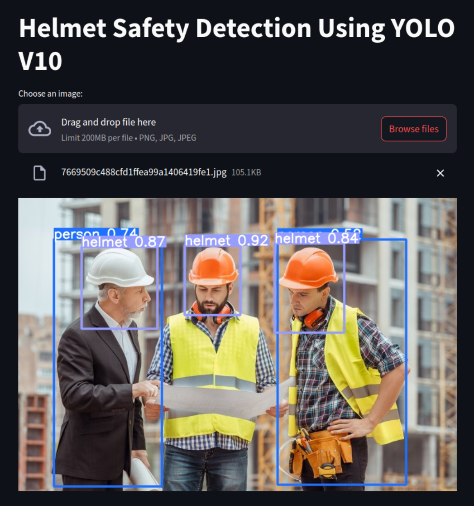

# HelmetSafetyDetection-YoloV10-FinetuningPretrainedModel

## Description

This project focuses on fine-tuning the pre-trained YOLOv10 model for detecting helmet usage in various safety scenarios. The training process utilizes a specific dataset tailored for helmet safety detection, which addresses the problem of ensuring construction workers are wearing helmets.


## Build Helmet Safety Detection with-out UI: Using Google Colab

To use it, access the file **helmet_safety_detection_yolov10_colab.ipynb** and follow the instructions to fine-tune the pre-trained YOLOv10 model.

After installation, you will save the best model weights, which can be found in the file **best.pt**.

## Build Helmet Safety Detection with UI: Using Streamlit

### Demo

<div align="center">
  
</div>

### How to use

#### 1. Create conda enviroment (recommend version python >= 3.9)

```bash
$ conda create -n <env_name> -y python=3.11
$ conda activate <env_name>
```

#### 2. Clone YOLOv10

```bash
$ git clone https://github.com/THU-MIG/yolov10.git
$ cd yolov10
```

#### 3. Install all required packages of YOLO v10 and streamlit 

```bash
$ pip install -q -r requirements.txt
$ pip install -e .
$ pip install -q streamlit
$ cd ..
```

#### 4. Run project 

```bash
$ streamlit run app.py
```


 